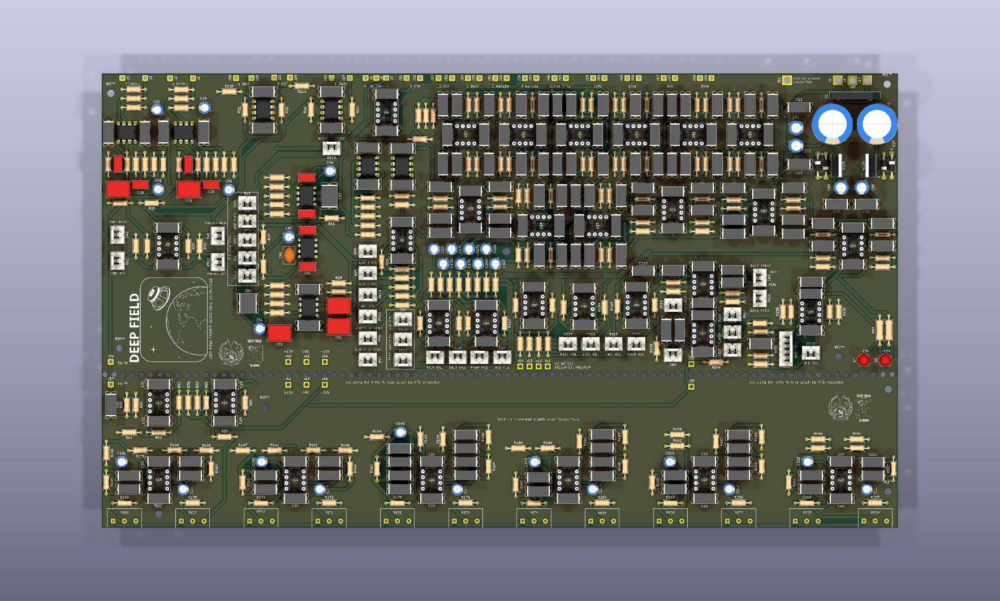

# Deep Field Preamp V1

A 4-way DIY dub preamp — open source, free, and built to be modified.



<!-- Render generated with:
     kicad-cli pcb render -o docs/images/board-top.png --quality high \
       --width 1800 --height 1080 --side top --background opaque --zoom 1.35 \
       hardware/deep-field-preamp.kicad_pcb
     Replace with a photo of a built unit when you have one. -->

## Features

- 4-way crossover with kill switches and level control per band
- 4-band parametric EQ
- 12-band graphic EQ
- Phono and line inputs for music sources
- 2 aux inputs
- 1 mic input
- 2 FX loops

## Project status

| Item | Version |
| --- | --- |
| Schematic / PCB source | V1 |
| Schematic PDF | V1 rev2 |
| Gerbers | V1.2 |

> **Note:** the source files, the PDF and the gerbers currently carry three
> different version labels. If you are ordering boards, treat
> `production/v1.2/` as the authoritative set and check it against the source
> before committing to a run.

## Repository layout

```
hardware/          KiCad 9 project — schematic, PCB and project file
docs/              Schematic PDF and build documentation
production/v1.2/   Gerbers and drill files, ready to send to a fab house
```

## Building one

1. **Order the boards.** Upload `production/v1.2/deep-field-preamp-v1.2-gerbers.zip`
   to your fab house of choice — it contains the gerbers, both drill files and
   the job file.
2. **Get the parts.** <!-- TODO: export a BOM from KiCad (File → Export → BOM)
   and commit it as docs/bom.csv, then link it here. -->
3. **Open the design.** `hardware/deep-field-preamp.kicad_pro` opens in
   KiCad 9.0 or newer. The schematic is also in `docs/` as a PDF if you just
   want to read it.

## Contributing

If you find a mistake I made, or a way to improve the design, please open an
issue or a pull request — I would rather have it fixed in the open than in
someone's private fork. And if you build your own Deep Field, share it! I would
love to see your builds.

## Licence

This work shall remain open source and free.

- **Hardware** (schematics, PCB layout, gerbers): [CERN Open Hardware Licence
  Version 2 — Strongly Reciprocal](LICENSE-hardware.txt) (CERN-OHL-S-2.0)
- **Documentation** (PDF, images, this README): [Creative Commons
  Attribution-ShareAlike 4.0 International](LICENSE-docs.txt) (CC BY-SA 4.0)

Both are share-alike: if you make your own version of this preamp, you are free
to build it, sell it and modify it, but you must publish your changes under the
same conditions I did.

## Contact

Deep Field Audio on Instagram and Facebook.

---

All you have here is work I spent countless hours on, and that I'm really happy
to share with you.

— Nélo Breuiller
